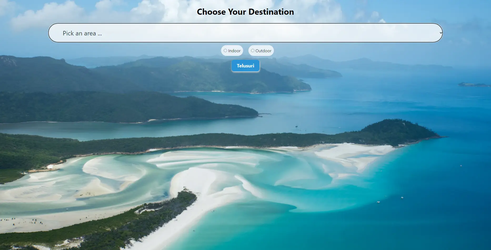

# Get2Go
> Traveling, Traveling and the Beauty of Your Dreams Explore "The Other Side of Jakarta"

## Table of Contents
* [Pendahuluan](#pendahuluan)
* [Informasi](#informasi)
* [Anggota Project](#anggota-project)
* [Teknologi](#teknologi)
* [Screenshots](#screenshots)
* [License](#license)

## Pendahuluan
Get2Go adalah aplikasi berbasis web yang memiliki visi mempermudah para wisatawan untuk mendapatkan rekomendasi dan informasi mengenai tempat wisata di Indonesia.

## Informasi
Informasi yang ditampilkan di aplikasi Get2Go, yaitu:
- Detail tempat wisata
- Deskripsi tempat wisata
- Jam operasional tempat wisata
- Harga tiket masuk tempat wisata
- Galeri foto dan/atau video tempat wisata

## Anggota Project
- Akhmad Deewa Prambudi (Researcher)
- [Hanif Mishbah Zulfikar](https://github.com/BossBaby11) (Project Manager & Frontend Developer)
- Bima Gifara (Researcher)
- Rizki Akbar Putra Hermawan (Designer)
- [Ryan Faiz Sanie](https://github.com/ryanfaiz) (Backend Developer & Database Administrator)
- [Zalfa Rania Hawa](https://github.com/zalfarh) (Head of Research Division)

## Teknologi
- Apache - versi 2.4.54
- MariaDB - versi 10.4.24
- PHP - versi 8.1.10

## Screenshots

## License
MIT License

Copyright (c) 2022 [BossBaby11](https://github.com/BossBaby11), [ryanfaiz](https://github.com/ryanfaiz), and [zalfarh](https://github.com/zalfarh)

Permission is hereby granted, free of charge, to any person obtaining a copy of this software and associated documentation files (the "Software"), to deal in the Software without restriction, including without limitation the rights to use, copy, modify, merge, publish, distribute, sublicense, and/or sell copies of the Software, and to permit persons to whom the Software is furnished to do so, subject to the following conditions:

The above copyright notice and this permission notice shall be included in all copies or substantial portions of the Software.

THE SOFTWARE IS PROVIDED "AS IS", WITHOUT WARRANTY OF ANY KIND, EXPRESS OR IMPLIED, INCLUDING BUT NOT LIMITED TO THE WARRANTIES OF MERCHANTABILITY, FITNESS FOR A PARTICULAR PURPOSE AND NONINFRINGEMENT. IN NO EVENT SHALL THE AUTHORS OR COPYRIGHT HOLDERS BE LIABLE FOR ANY CLAIM, DAMAGES OR OTHER LIABILITY, WHETHER IN AN ACTION OF CONTRACT, TORT OR OTHERWISE, ARISING FROM, OUT OF OR IN CONNECTION WITH THE SOFTWARE OR THE USE OR OTHER DEALINGS IN THE SOFTWARE.
